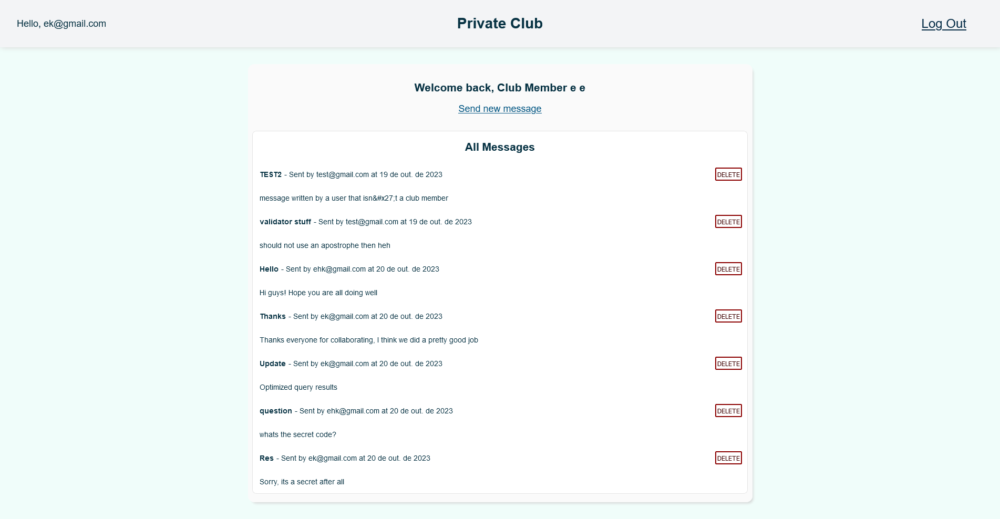

# Members-Only Club Website

This is the next in my series of Node-based learning projects. This site is a "Private Club" in which one can create an account and write messages. However, only members of the club can see who set what message and when, and for one to become a member, they must first know the secret code. Furthermore, one can even become an Admin, if they know the secret code for that, which results in the ability to remove messages.

This served as a great project to familiarize myself even more with the back-end, as well as introduce me to cookies (account sessions) and security (passwords). Since this is mainly a learning experience to the back-end, I didn't focus that much on CSS, though I still made it look nice.

Overall, working with the back-end is more difficult than I initially thought, but I am liking it.

This project is part of The Odin Project curriculum.

Link to deployed project: https://members-only-production-8605.up.railway.app/
